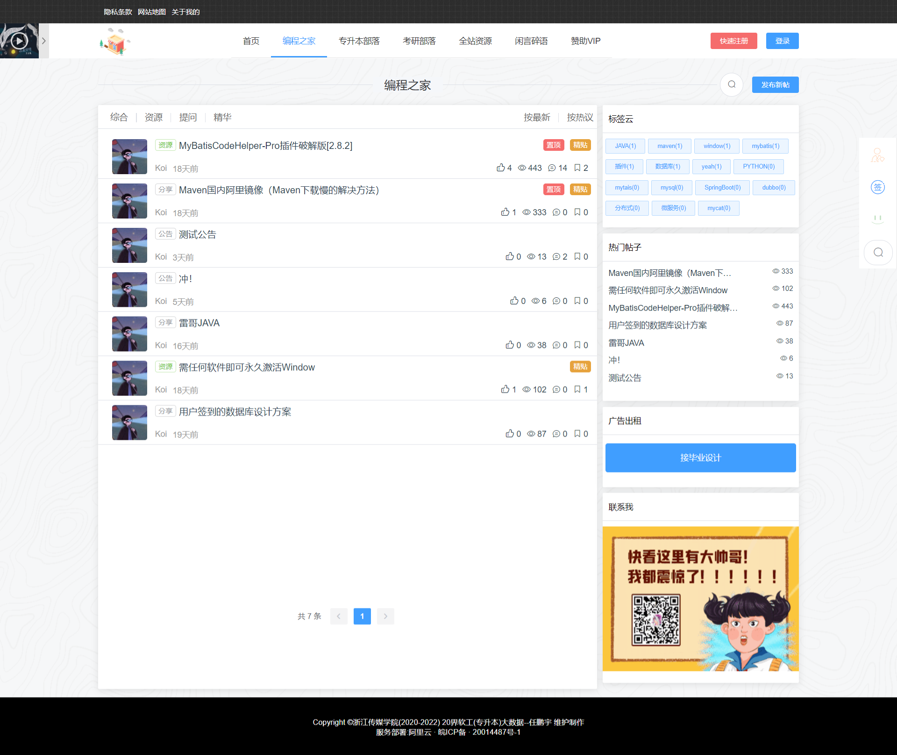
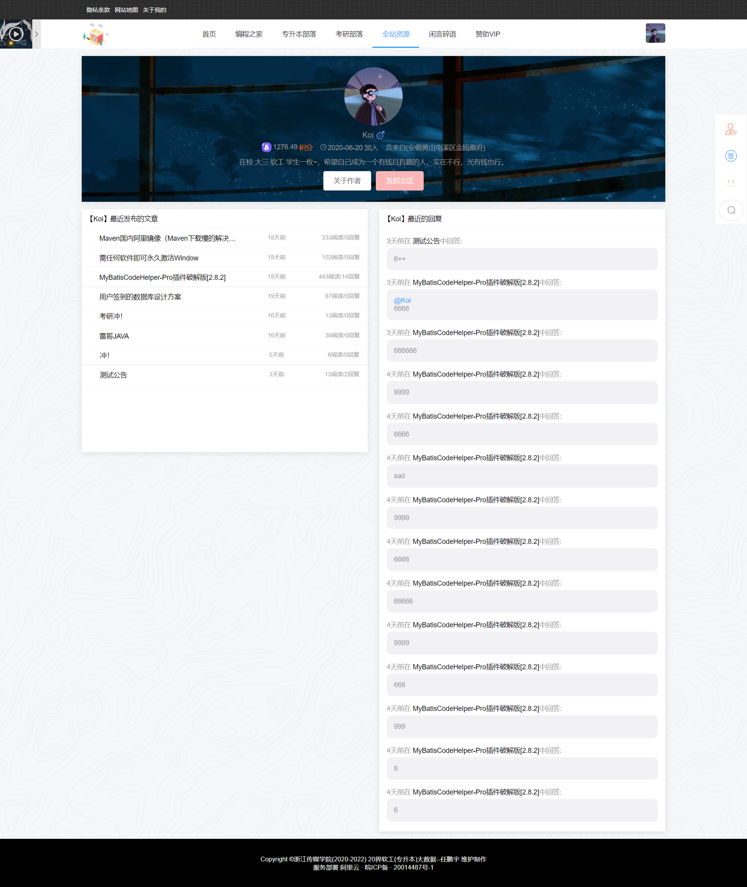
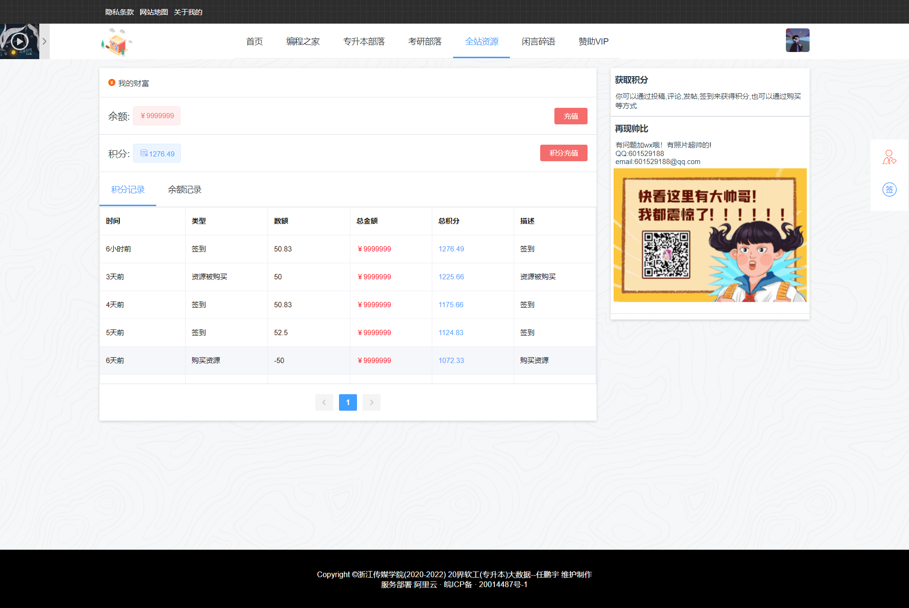
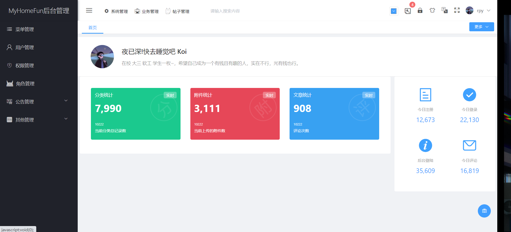

# MyHomeFun(我的趣屋论坛)

前后端分离的一款论坛bbs系统

#### 在线观看

- 前端 前台地址：www.myhomefun.cn   

  项目地址：https://github.com/yasuosa/MyHomeFun_front

- 前端 后台地址 ： admin.myhomefun.cn

  项目地址：https://github.com/yasuosa/MyHomeFun_admin

### 功能介绍

- 权限管理：完备的系统权限管理，包括系统用户，角色，权限，菜单。
- 内容管理：管理系统用户所有文章，包括帖子、博客及文章评论
- 文件管理：暂时使用fastdfs，后续会更新到阿里云oss。
- 自动缓存：redis进行部分数据的缓存。
- 在线支付（积分)：实现个人免签的第三方支付方式,因为没有商家认证无法注册。
- 订单管理：实现用户自动下单功能。
- 三方登陆：还在申请注册。
- 日志：用于记录用户对系统的操作，同时监视系统运行时发生的错误。
- 签到管理：用户签到
- 其他...（功能还有很多，感觉去看看吧）。

### 开发环境

- Idea maven 3+
- redis 
- springboot + shiro +jwt 
- druid
- mysql 5.7
- fastdfs
- lombok 等等

##  更新记录

### `2020-08-13`

[新增]初始提交

##  运行过程

1. clone项目到IDE中
2. 在mysql中创建myhomefun的数据库名，并导入执行sql/myhomefun.sql
3. 修改配置文件application-core.yml中数据库和redis的配置信息，改成自己本地的。
4. 修改配置文件 application-admin.yml 中 邮箱发送配置的自己的信息
5. 启动https 在将注释 打开，并申请 https证书 
6. mvn install package
7. 前台地址：localhost:4396 
   后台地址： localhost:4399

##  后台

